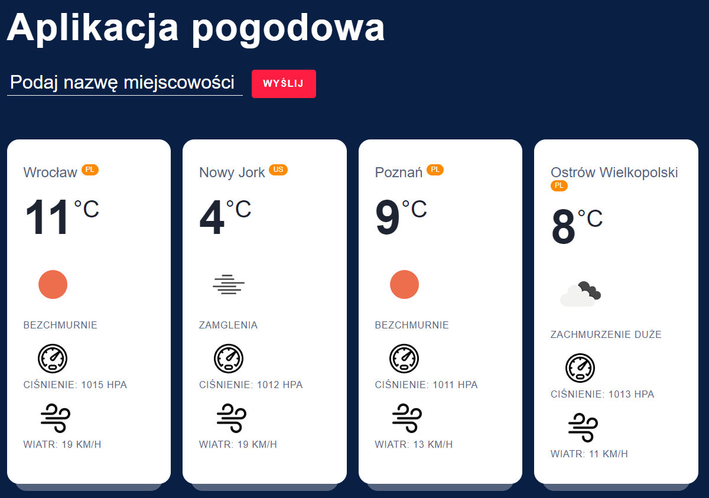

# Weather-web-app
Web app - check weather in any city aroud the world using API OpenWeatherMap.

## Table of Contents
* [General Info](#general-information)
* [Technologies Used](#technologies-used)
* [Screenshots](#screenshots)
* [Project Status](#project-status)
* [Acknowledgements](#acknowledgements)

## General Information
Type the city and click "WYŚLIJ" button. Then you will get info about the weather (temperature, wind, pressure) in typed city. The application will work on any device with different screen widths.

## Technologies Used
- JavaScript
- HTML/CSS
- API (OpenWeatherMap)
- AJAX (Fetch)

## Screenshots
 

## Project Status
Project is: _no longer being worked on_.

## Acknowledgements
- Program is based on book _JavaScript, HTML, CSS, PHP, WordPress - Tworzenie stron i aplikacji webowych, kurs programowania od podstaw_ by Krzysztof Dziedzic, Komputer Świat.
- Icons from _https://www.flaticon.com/_.
- CSS code from _https://codepen.io/tutsplus/pen/gObLaEP_.
